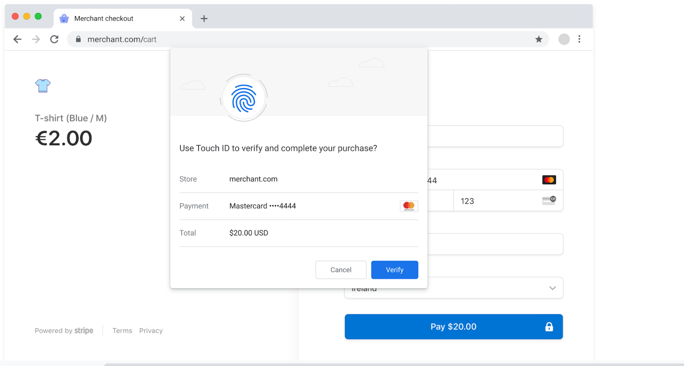

# Secure Payment Confirmation Developer Guide

> **NOTE**: This guide was written for an earlier version of SPC, and is now
> out of date. A more up-to-date guide can be found [on
> developer.chrome.com](https://developer.chrome.com/payments/).

This guide was written by members of the Google Chrome team, to support web
developers experimenting with Secure Payment Confirmation (SPC) as part of the
[SPC v0.2 Origin
Trial](https://groups.google.com/u/1/a/chromium.org/g/blink-dev/c/6Dd00NJ-td8/m/NUGXlyG2BwAJ).
It gives an overview of what SPC is, explains how to experiment with it on your
website, and provides an FAQ.

## What is SPC v0.2?

Secure Payment Confirmation is a standard-track web API proposal that enables
[FIDO-based authentication](https://fidoalliance.org/) for web payments.

Users **enroll** a payment instrument using on-device biometrics, creating a
FIDO credential that can be held by the relying party (e.g. a PSP or issuer).
This credential can be used in later transactions to **authenticate** the user
and produce a signed challenge that includes the transaction value, which can
be verified by the PSP/issuer.

Stripe and Chrome collaborated on a first Origin Trial in Q4, 2020 which showed
that SPC provided a higher conversion rate and faster authentication time than
3DS2 step-up flows.

- [API explainer](https://github.com/w3c/secure-payment-confirmation/blob/main/README.md)
- [WPWG blog post](https://www.w3.org/blog/wpwg/2021/03/26/secure-payment-confirmation-stripe-experiment-and-next-steps/)
- [Experiment results](https://www.w3.org/2021/Talks/spc-pilot-202103.pdf)

The second version of the Origin Trial (v0.2) improves on the first by
**allowing enrollment from cross-origin iframes and a new associated browser
dialog**. Other than this permission change, the API shape is unchanged.

Secure Payment Confirmation v0.2 is available for developer testing in Chrome
Beta, and will soon be available in stable channels as an [Origin
Trial](https://github.com/GoogleChrome/OriginTrials). 

## Using SPC v0.2 on your website

This section explains how to enable Secure Payment Confirmation locally on your
device for testing, and how to enable it for users of your site via the v0.2
Origin Trial.

Quick links to code snippets:
- [How to enroll a credential](https://github.com/w3c/secure-payment-confirmation#creating-a-credential)
- [How to authenticate a payment](https://github.com/w3c/secure-payment-confirmation#authenticating-a-payment)
- [SPC challenge and signature format](https://github.com/w3c/secure-payment-confirmation#transaction-binding-and-web-payments-cryptogram)

### Step 1: Get a compatible computer

Currently, SPC is available on:

* MacOS with the
  [secure enclave](https://support.apple.com/en-ca/guide/security/sec59b0b31ff/web)
  feature (e.g., 2016 MacBookPro or later).
* Windows 10 with [Windows
  Hello](https://support.microsoft.com/en-us/windows/learn-about-windows-hello-and-set-it-up-dae28983-8242-bb2a-d3d1-87c9d265a5f0)
  support (e.g., version 1607 or later).

Note that the feature is designed for use with biometric authenticators such as
Touch ID on Mac, but more generally it is compatible with
[user-verifying platform authenticators](https://www.w3.org/TR/webauthn/#user-verifying-platform-authenticator)
that may use a device PIN, for example.

### Step 2: Get a compatible version of Chrome

The v0.2 version of SPC is available from Chrome version 91 onwards (currently
in Beta, releasing to Stable in late May 2021).

You can test out the feature by registering your site in the origin trial (see
below), or by enabling the flag chrome://flags#enable-experimental-web-platform-features.
You can verify that you have the right version of Chrome by trying out this
[test page](https://rsolomakhin.github.io/pr/spc/).

### Step 3: Enable the Origin Trial on your website

Enabling SPC via Origin Trial for your website will make it available to users
of Google Chrome, without them having to set any flag locally on their client.

Origin Trials are origin-bound, time-limited releases of experimental features
in Chrome, used to test whether upcoming web APIs are useful and to let web
developers gather real-world data and provide feedback. **Production systems
should not rely on a feature in Origin Trial existing for any given user, or
continuing to exist in the future.**

To enroll your website in the SPC v0.2 Origin Trial, register your origin for
the trial
[here](https://developer.chrome.com/origintrials/#/view_trial/2735936773627576321).
The [Origin Trial Developer
Guide](https://github.com/GoogleChrome/OriginTrials/blob/main/developer-guide.md)
explains how to enable the feature on your website once registered.

## Frequently Asked Questions

### What makes Secure Payment Confirmation different than WebAuthn?

SPC is similar in concept to WebAuthn, but has two key differences:

1. A `PaymentCredential` can be created inside a cross-origin iframe, which is
   not allowed in WebAuthn. This supports user enrollment during the common
   payments flow of a `bank.com` embedded-iframe inside a top-level
   `merchant.com` or `psp.com` website.
2. An origin my authenticate a user with the `PaymentCredential` of a
   different origin. For example, `merchant.com` can exercise a
   credential whose relying party is `bank.com`. This allows merchants or
   PSPs to use SPC authentication without the friction of redirecting
   to an issuer bank website.

SPC also provides a standardized format for including transaction details
(amount and currency) inside the signed assertation. This is possible to do
with WebAuthn today, but SPC brings a convenient and standardized way to do
it via a native browser user experience.

### Why is PaymentCredential bound to a payment instrument rather than to just the Relying Party?

This is a good question, and one we are still exploring and would love input on!

Having the credential be per-instrument was a convenient way to ensure that the
user is presented with the correct instrument details during authentication.
Relaxing this requirement would make SPC more powerful, and individual Relying
Parties (RPs) could still opt to make credentials on a per-instrument basis -
but UXR explorations are needed to ensure the user understands the situation.

### What are the maximum dimensions of the payment instrument icon when registering a PaymentCredential?

Chrome's current implementation expects an icon that is 32px wide by 20px high.

### Can I re-use a user ID during registration?

Please avoid re-using the same user ID during registration, because that will
overwrite any existing credentials on the authenticator device that have the
same user ID and the same RP ID. The recommendation is to use unique user ID
for each registration, unless your goal is to erase your RP's existing
credentials on the authenticator. 

Keep in mind that Chrome 95 at the time of writing uses disk cache where it
stores the public credential identifiers. If a credential is erased from the
authenticator device but remains the SPC disk cache, then the payment flow
will display browser UI, but the operating system prompt for biometric will
return an error to the website.

## Questions & Feedback

Please contact payments-dev@chromium.org.
